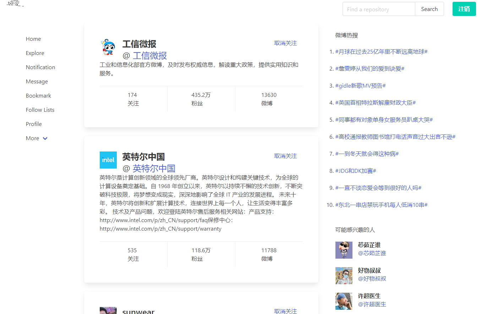
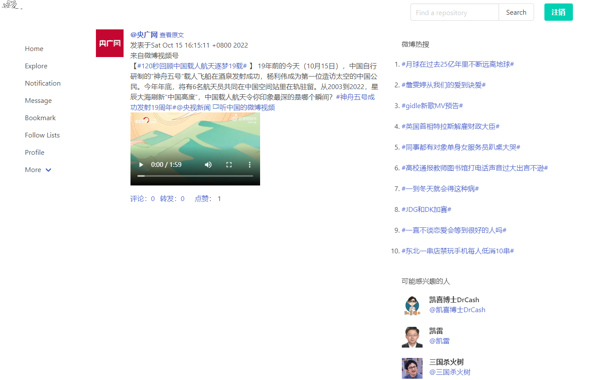
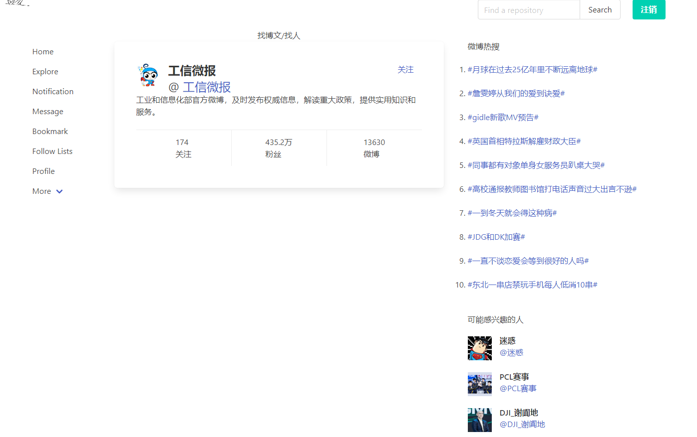
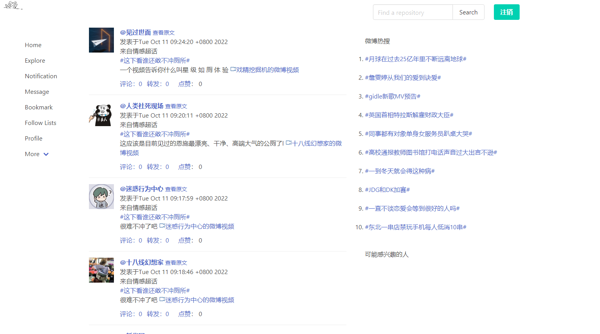

# [悠然微博](http://1.14.73.45:18089/)：微博爬虫、微博本地化部署

## 【文档不完善，继续补充中。】

## 20250323 更新v0.3.0
- 优化了UI
- 优化了大部分的业务逻辑
- 取消每日统计，改为实时更新

## 20231007更新v0.2.0

- 更新UI:about中新增每日博文和博主数
- 完善爬取逻辑：
  - 随机爬取全站每个用户前5页
  - 定时抓取我的关注博主的博文(使用cookie)
  - 定时更新热搜
  - 从评论中抓取全站用户信息，以保证抓取到的是活跃用户
  - 每天抓取最新一次代理IP
  - 每天做一次用户和博文的统计

## 20221015更新

- 更新UI
- 完善爬取逻辑

## 主要功能：

- 爬取全站微博
- 抓取全站博主信息
- 实时抓取全站热搜
- 本地化部署微博
- 关注博主/搜索博主/收藏博文

## 功能展示

- 个人主页

- 关注页

- 博文页

- 搜索博主

- 随机博文

## todo

- 完善文档

## 功能

## 部署

