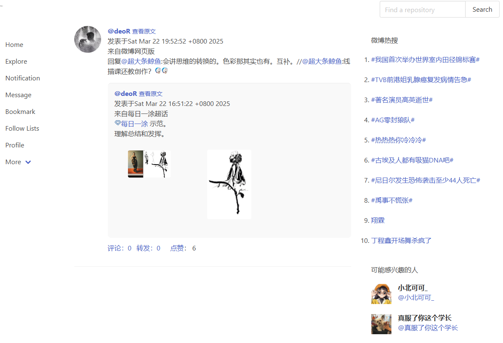

# [悠然微博](http://122.51.50.206:8088)：微博爬虫、微博本地化部署

## 【文档不完善，继续补充中。】

## 主要功能：

- 爬取全站微博
- 抓取全站博主信息
- 实时抓取全站热搜
- 本地化部署微博
- 关注博主/搜索博主/收藏博文

## 功能展示

- 用户主页


- 个人主页


- 关注页


- 博文页


- 搜索博主


- 随机博文


- 随机博主


## todo
- 完善网页界面
- 完善文档

## 功能

## docker部署

```
git clone https://github.com/lixiang0/WeiboSpider
cd WeiboSpider/

# 1.mongo
docker run -p 27017:27017 --name docker_mongodb -d mongo

# 2.minio
docker run \
  -p 9000:9000 \
  -p 9001:9001 \
  --name minio1 \
  -e "MINIO_ROOT_USER=minio" \
  -e "MINIO_ROOT_PASSWORD=minio" \
  -v /mnt/data:/data \
  quay.io/minio/minio server /data --console-address ":9001"

# 3.[可选]关于cookie 
# https://github.com/moonD4rk/HackBrowserData
# cookie保存在results目录下

# 4.部署
# 注意docker-compose.yml里面的mongodb和minio的地址
sudo docker-compose up -d --build
```


